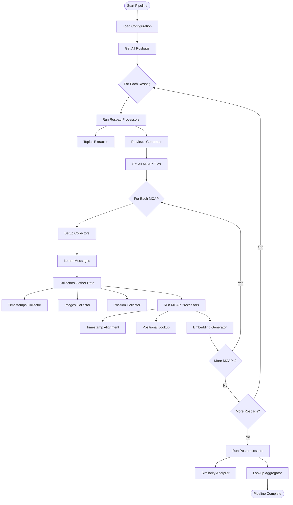
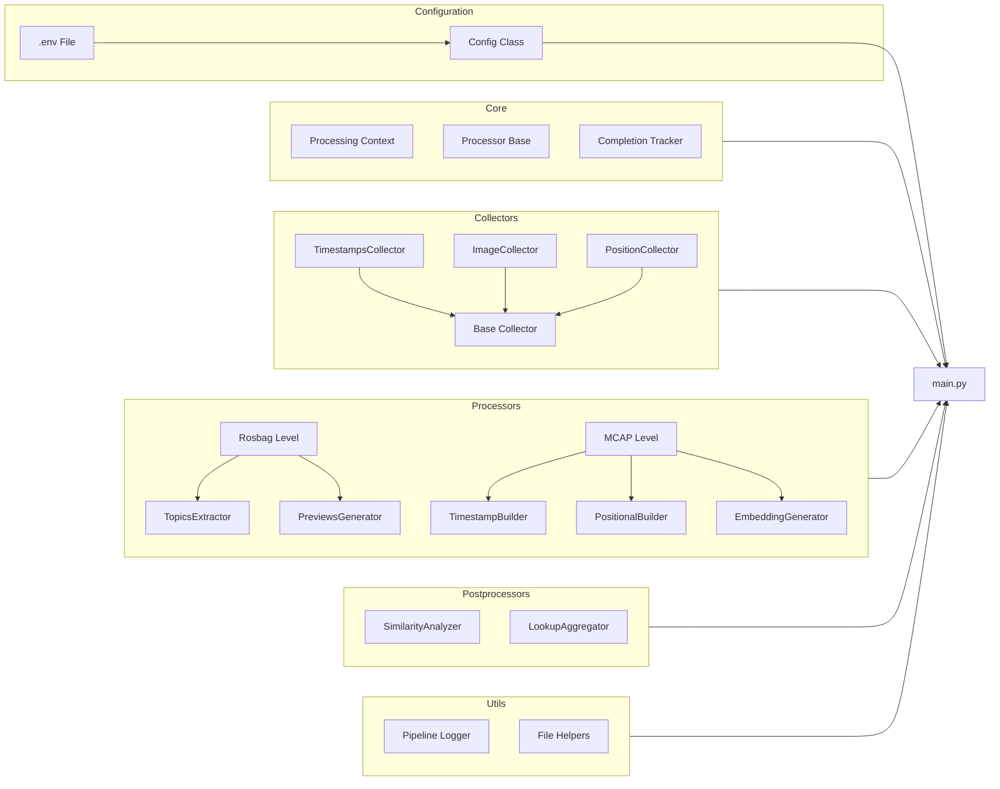
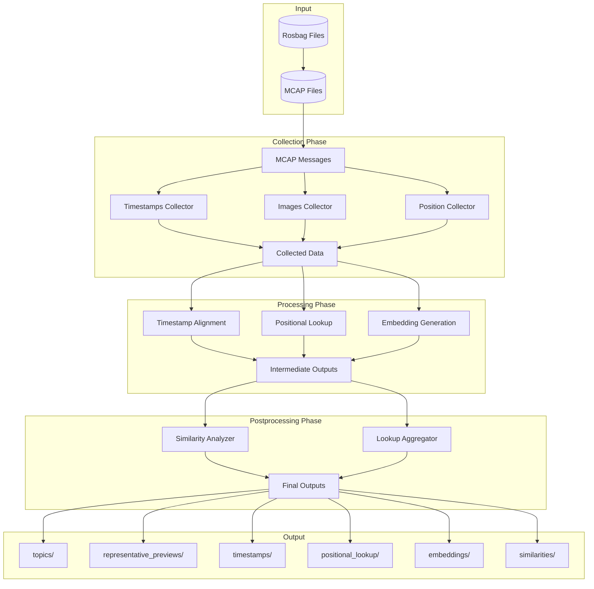

# Rosbag Processing Pipeline

A modular, resumable pipeline for multi-level rosbag processing with comprehensive data extraction, transformation, and analysis capabilities.

## Table of Contents

- [Overview](#overview)
- [Architecture](#architecture)
- [Directory Structure](#directory-structure)
- [Components](#components)
- [Quick Start](#quick-start)
- [Configuration](#configuration)
- [Pipeline Flow](#pipeline-flow)

---

## Overview

This pipeline processes rosbag files (in MCAP format) through a three-stage architecture:

1. **Collection Phase**: Efficiently gather data from MCAP messages in a single pass
2. **Processing Phase**: Transform collected data at rosbag and MCAP levels
3. **Postprocessing Phase**: Aggregate and analyze results across all processed data

### Key Features

- **Modular Design**: Plug-and-play processors and collectors
- **Resumable**: Built-in completion tracking to skip already-processed files
- **Efficient**: Single-pass message iteration with shared collectors
- **Configurable**: Environment-based configuration via `.env` files
- **Type-Safe**: Full type hints and validation
- **Extensible**: Abstract base classes for custom processors and collectors

---

## Architecture

### High-Level Pipeline Flow



### Component Architecture



---

## Directory Structure

```
preprocessing/
├── main.py                          # Pipeline entry point
├── config.py                        # Configuration management
├── .env                             # Environment variables (user-specific)
├── .env.example                     # Environment template
│
├── core/                            # Core infrastructure
│   ├── base.py                      # Base classes (Processor, ProcessingContext)
│   ├── completion.py                # Completion tracking
│   └── __init__.py
│
├── collectors/                      # Message-level data collectors
│   ├── base_collector.py            # Abstract base collector
│   ├── timestamps_collector.py      # Collect timestamp data
│   ├── image_messages_collector.py  # Collect image messages
│   ├── position_messages_collector.py  # Collect position data
│   └── __init__.py
│
├── processors/                      # Data processors
│   ├── rosbag/                      # Rosbag-level processors
│   │   ├── topics_extractor.py      # Extract topic information
│   │   ├── representative_previews_generator.py  # Generate preview images
│   │   └── __init__.py
│   │
│   ├── mcap/                        # MCAP-level processors
│   │   ├── timestamp_alignment_builder.py  # Build timestamp lookups
│   │   ├── positional_lookup_builder.py    # Build spatial indices
│   │   ├── embedding_generator.py          # Generate embeddings
│   │   └── __init__.py
│   │
│   └── __init__.py
│
├── postprocessors/                  # Post-pipeline aggregation
│   ├── adjacent_similarity_analyzer.py  # Analyze embedding similarities
│   ├── positional_lookup_aggregator.py  # Aggregate position data
│   └── __init__.py
│
└── utils/                           # Utility functions
    ├── logger.py                    # Custom logging
    ├── file_helpers.py              # File/directory utilities
    └── __init__.py
```

---

## Components

### Core Infrastructure

#### `ProcessingContext`
Shared context passed through the pipeline containing:
- `rosbag_path`: Path to current rosbag
- `mcap_path`: Path to current MCAP file (optional)
- `output_dir`: Output directory
- `cache_dir`: Cache directory

#### `Processor` (Abstract Base Class)
Base class for all processors with:
- Processing level (ROSBAG, MCAP, MESSAGE)
- `process()`: Main processing method
- `should_process()`: Conditional execution logic
- `required_collectors`: List of needed collector classes

#### `CompletionTracker`
Tracks completed processing tasks to enable resumability:
- JSON-based completion status
- Per-rosbag/MCAP tracking
- Output file validation

### Collectors

Collectors iterate through MCAP messages once and gather data for processors.

| Collector | Purpose | Output |
|-----------|---------|--------|
| **TimestampsCollector** | Collect message timestamps | Timestamp-to-index mappings |
| **ImageMessagesCollector** | Collect image messages with metadata | List of `ImageMessage` objects |
| **PositionMessagesCollector** | Collect position/GPS data | List of `PositionMessage` objects |

**Key Methods**:
- `wants_message(message)`: Filter which messages to collect
- `collect_message(message, channel, schema)`: Process a message
- `get_data()`: Return collected data

### Processors

#### Rosbag-Level Processors

| Processor | Purpose | Dependencies |
|-----------|---------|--------------|
| **TopicsExtractor** | Extract all topics and their metadata | None |
| **FencepostCalculator** | Calculate fencepost positions and collect representative images | FencepostImageCollector |

#### MCAP-Level Processors

| Processor | Purpose | Dependencies |
|-----------|---------|--------------|
| **TimestampAlignmentBuilder** | Build timestamp lookup tables | TimestampsCollector |
| **PositionalLookupBuilder** | Build spatial grid indices | PositionMessagesCollector |
| **EmbeddingGenerator** | Generate embeddings with sharding | ImageMessagesCollector |

### Postprocessors

Run after the main pipeline completes:

| Postprocessor | Purpose |
|---------------|---------|
| **AdjacentSimilarityAnalyzer** | Compute similarities between adjacent embeddings |
| **PositionalLookupAggregator** | Aggregate per-MCAP position data into rosbag-level lookups |

### Configuration

The `Config` class manages all pipeline settings via `.env` files:

```python
from preprocessing import Config

# Load configuration
config = Config.load_config()

# Access settings
print(config.rosbags_dir)
print(config.output_dir)
print(config.grid_size)
print(config.embedding_models)
```

---

## Quick Start

### 1. Installation

```bash
# Install dependencies
pip install python-dotenv mcap

# Navigate to project
cd /path/to/python/preprocessing
```

### 2. Configuration

Copy and edit the environment file:

```bash
cp .env.example .env
```

Edit `.env` with your paths:

```bash
ROSBAGS_DIR=/path/to/your/rosbags
OUTPUT_DIR=/path/to/output
GRID_SIZE=10.0
EMBEDDING_MODELS=model1,model2
SHARD_SIZE=100000
```

### 3. Run Pipeline

From the parent directory:

```bash
cd /path/to/python
python -m preprocessing.main
```

Or with PYTHONPATH:

```bash
cd /path/to/python/preprocessing
PYTHONPATH=/path/to/python:$PYTHONPATH python main.py
```

---

## Configuration

### Environment Variables

| Variable | Description | Default |
|----------|-------------|---------|
| `ROSBAGS_DIR` | Directory containing rosbag files | `/path/to/rosbags` |
| `OUTPUT_DIR` | Output directory for results | `/path/to/output` |
| `GRID_SIZE` | Grid cell size in meters for positional lookup | `10.0` |
| `EMBEDDING_MODELS` | Comma-separated list of embedding models | `model1,model2` |
| `SHARD_SIZE` | Number of embeddings per shard file | `100000` |

### Config Class Properties

```python
config.rosbags_dir: Path      # Input directory
config.output_dir: Path       # Output directory
config.grid_size: float       # Grid size for spatial indexing
config.embedding_models: List[str]  # Models to use
config.shard_size: int        # Shard size for embeddings
```

---

## Pipeline Flow

### Data Flow Diagram



### Output Structure

```
output/
├── topics/                         # Topic extraction results
│   └── {rosbag_name}/
│       └── topics.json
│
├── representative_previews/        # Preview images
│   └── {rosbag_name}/
│       └── preview.png
│
├── timestamps/                     # Timestamp alignment tables
│   └── {rosbag_name}/
│       └── {mcap_name}_timestamps.json
│
├── positional_lookup/             # Per-MCAP position data
│   └── {rosbag_name}/
│       └── {mcap_name}_positions.json
│
├── positional_lookup_aggregated/  # Aggregated position data
│   └── {rosbag_name}.json
│
├── embeddings/                    # Embedding shards
│   └── {rosbag_name}/
│       └── shard_*.pkl
│
└── similarities/                  # Similarity analysis
    └── {rosbag_name}_similarities.json
```

Each directory contains a `completion.json` file for tracking processing progress.

---

## Extending the Pipeline

### Creating a Custom Collector

```python
from preprocessing.collectors import BaseCollector

class MyCollector(BaseCollector):
    def __init__(self):
        super().__init__()
        self.data = []
    
    def wants_message(self, message):
        # Filter messages you want
        return True
    
    def collect_message(self, message, channel, schema):
        # Process and store message data
        self.data.append(message)
    
    def get_data(self):
        return self.data
```

### Creating a Custom Processor

```python
from preprocessing.core import Processor, ProcessingLevel

class MyProcessor(Processor):
    def __init__(self):
        super().__init__("MyProcessor", ProcessingLevel.MCAP)
        self.required_collectors = [MyCollector]
    
    def process(self, context, data):
        # Access collector data
        my_data = data.get('MyCollector', {})
        
        # Process data
        result = process_data(my_data)
        
        # Save results
        output_file = context.output_dir / "my_output" / f"{context.get_mcap_name()}.json"
        output_file.parent.mkdir(parents=True, exist_ok=True)
        save_results(output_file, result)
```

---

## Resumability

The pipeline automatically tracks completed work:

- **Completion Files**: Each output directory has a `completion.json`
- **Skip Logic**: Already-processed rosbags/MCAPs are skipped
- **Validation**: Checks if output files still exist
- **Force Reprocessing**: Delete `completion.json` to reprocess

---

## Development

### Project Status

- ✅ Core infrastructure complete
- ✅ Collectors implemented
- ✅ Processors implemented
- ✅ Configuration system complete
- ⚠️ Postprocessors have TODO implementations
- 📝 Documentation complete

### Dependencies

- `python-dotenv`: Environment configuration
- `mcap`: MCAP file reading
- Additional dependencies for specific processors (embeddings, image processing, etc.)

---

## License

[Add your license here]

## Contributing

[Add contribution guidelines here]

## Contact

[Add contact information here]
